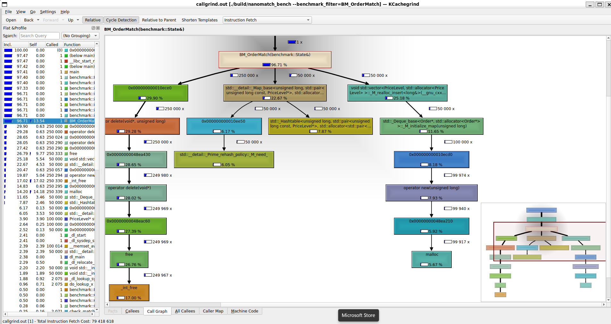

# NANOMATCH — Ultra-Low Latency Order Matching Engine

> A fully functional Limit Order Book (LOB) and matching engine written in C++17.
> Built from scratch as part of **FEC IIT Guwahati DIY '26 — Quant · Systems track.**

---

## Table of Contents

1. [What This Is](#what-this-is)
2. [Benchmark Results](#benchmark-results)
3. [Architecture](#architecture)
4. [File Structure](#file-structure)
5. [Why These Decisions](#why-these-decisions)
6. [Key Engineering Challenges](#key-engineering-challenges)
7. [Concepts Demonstrated](#concepts-demonstrated)
8. [How to Build and Run](#how-to-build-and-run)
9. [Profiling](#profiling)

---

## What This Is

Every stock exchange — NSE, NASDAQ, BSE — runs an order matching engine at its core.
When you place a trade, your order enters a Limit Order Book and gets matched against
the best available opposing order. NANOMATCH implements this from scratch in C++,
targeting the same architectural principles used by HFT firms.

The goal: process buy/sell orders on strict **price-time priority** with sub-microsecond
matching latency. A complete trade — buyer meets seller, fill generated, event logged —
executes in **114 nanoseconds**.

The engine was validated against **real NASDAQ TotalView-ITCH 5.0 market data** from
January 30, 2020 — a full trading day file (13GB uncompressed) containing 105,470
Add Orders, 98,525 Delete Orders, and 1,022 Executions. Binary parsing via mmap
achieves **85 nanoseconds per message** with zero copies and zero syscalls during parsing.

---

## Benchmark Results

**Hardware:** 16-core x86_64 · L1=48KB · L2=1280KB · L3=24MB · WSL2 Ubuntu 24.04

### Google Benchmark

| Benchmark | Time | What It Measures |
|-----------|------|-----------------|
| BM_OrderRest | 86 ns | Order insert with no match |
| BM_OrderMatch | 114 ns | Complete trade execution |
| BM_RingBuffer | 7 ns | Lock-free event logging |

### Synthetic Workload (100K orders, CSV pipeline)

| Metric | Result | Notes |
|--------|--------|-------|
| p50 latency | 260 ns | Median per-order match latency |
| p90 latency | 15,156 ns | Heavy multi-fill orders |
| p99 latency | 25,643 ns | Worst-case tail latency |
| p99.9 latency | 32,281 ns | Extreme tail latency |
| Parse avg | 256 ns | CSV field parsing per order |
| Throughput | ~137K orders/sec | End-to-end including CSV parse |
| Trade accuracy | 95,094 / 95,094 | Zero drops through ring buffer |

### Real NASDAQ ITCH Data (January 30, 2020 — 13GB trading day file)

| Metric | Result | Notes |
|--------|--------|-------|
| Add orders parsed | 105,470 | Real limit orders from NASDAQ |
| Delete orders | 98,525 | Cancellations via OrderBook::Cancel() |
| Executions seen | 1,022 | Fill notifications |
| Bytes parsed | 14,423,514 | Via mmap — zero copies |
| Pure parse speed | 85 ns/message | mmap scan, no matching overhead |
| Full pipeline speed | 1,267 ns/order | Parse + match + cancel path |
| Total time | 133 ms | For first 500K messages |

---

## Architecture

```
+----------------------------------------------------------+
|                    DATA INGESTION                        |
|   NASDAQ ITCH 5.0 binary (mmap)  /  Synthetic CSV       |
|            zero-copy binary parsing                      |
|            MemoryPool<Order> -- no heap alloc            |
+----------------------------+-----------------------------+
                             | Order*
+----------------------------v-----------------------------+
|                   ORDER BOOK CORE                        |
|   Bid Side                          Ask Side             |
|   vector<PriceLevel>                vector<PriceLevel>   |
|   sorted descending                 sorted ascending     |
|                  |   MATCHING ENGINE  |                  |
|               price-time priority matching               |
+----------------------------+-----------------------------+
                             | TradeEvent
+----------------------------v-----------------------------+
|              LOCK-FREE SPSC RING BUFFER                  |
|         atomic head/tail --> logger thread               |
+----------------------------------------------------------+
```

---

## File Structure

```
nanomatch/
├── CMakeLists.txt               # Build config
├── include/
│   ├── order.h                  # alignas(64) Order struct
│   ├── price_level.h            # FIFO deque of orders at one price
│   ├── order_book.h             # Full LOB: bid + ask vectors, O(1) cancel
│   ├── matching_engine.h        # Core match loop + ring buffer
│   ├── memory_pool.h            # Arena allocator -- zero heap on hot path
│   ├── ring_buffer.h            # Lock-free SPSC -- atomic head/tail
│   └── itch_parser.h            # NASDAQ ITCH 5.0 binary parser via mmap
├── src/
│   ├── main.cpp                 # CSV pipeline
│   ├── itch_main.cpp            # ITCH pipeline -- real NASDAQ data
│   └── itch_bench.cpp           # Pure mmap parse speed benchmark
├── bench/
│   └── bench_main.cpp           # Google Benchmark suite
├── assets/
│   └── callgrind_graph.png      # KCachegrind call graph
└── data/synthetic/
    └── gen_orders.py            # Generates N synthetic orders as CSV
```

---

## Why These Decisions

### alignas(64) on the Order Struct
Every Order is exactly 64 bytes -- one CPU cache line. The CPU fetches memory in
64-byte chunks. If an Order spans two cache lines, the CPU needs two fetches instead
of one -- double the latency. alignas(64) enforces the boundary.
static_assert(sizeof(Order) == 64) makes the compiler verify this at build time.

### Sorted vector Instead of std::map
std::map is a red-black tree. Every node is a separate heap allocation scattered in
memory. Accessing 10 price levels means 10 pointer chases and 10 potential cache
misses. A sorted vector of 10 levels fits in one cache line. Linear scan beats tree
traversal for the small number of active price levels typical in a real order book.

### Memory Pool
malloc() takes ~200ns per call. The pool pre-allocates 200K Order slots in one
aligned_alloc() call at startup. Acquire() pops a slot in ~5ns. Zero OS calls,
zero heap fragmentation on the hot path.

### mmap for Binary Data Ingestion
fread() copies data from the kernel buffer into the application buffer -- two copies
per read. mmap() maps the file directly into virtual address space. The ITCH parser
works on raw pointers with no memcpy. madvise(MADV_SEQUENTIAL) enables kernel
read-ahead. Result: 85 ns/message on 13GB of real NASDAQ trading data.

### Lock-Free SPSC Ring Buffer
A mutex triggers a futex() syscall when contended -- 1 to 10 microseconds, longer
than the entire match cycle. The SPSC ring buffer uses std::atomic head and tail
indices with memory_order_release / memory_order_acquire ordering. No kernel
involvement. No blocking. Both indices have their own alignas(64) cache line to
prevent false sharing between the producer and consumer cores.

### Profiling Result
Callgrind revealed 44% of CPU instructions in benchmarks were heap allocator calls
and only 8% were actual matching logic -- confirming the memory pool as the single
highest-impact optimisation. Cache simulation showed D1 miss rate of 0.05% and LLd
miss rate of 0.03%, confirming cache alignment is working correctly.

---

## Key Engineering Challenges

**1. assert() silently disabled in Release builds**
CMake Release mode passes -DNDEBUG, stripping all assert() calls at compile time.
A quantity conservation check appeared to pass while numbers showed a mismatch.
Fixed with explicit if-checks that work in all build modes.

**2. Const correctness compiler error**
BestBid() and BestAsk() were called on a const OrderBook reference. Fixed by adding
const overloads -- the compiler picks the correct version based on const-qualification.

**3. False sharing in the ring buffer**
head_ and tail_ on the same cache line caused constant cross-core cache-line transfer.
Fixed with alignas(64) on both, giving each its own dedicated cache line.

**4. Ghost price levels after cancel**
Cancelling the last order at a price left an empty PriceLevel in the vector, causing
null dereference. Fixed with the erase-remove idiom using std::remove_if.

---

## Concepts Demonstrated

- CPU cache hierarchy and cache line alignment
- Custom arena memory allocator (placement new, free-list)
- Lock-free concurrency with std::atomic and memory ordering
- Price-time priority matching algorithm
- SPSC ring buffer for producer-consumer decoupling
- NASDAQ TotalView-ITCH 5.0 binary protocol parsing
- Zero-copy data ingestion via mmap
- Callgrind profiling and bottleneck identification
- Google Benchmark for statistical latency measurement (p50, p90, p99)
- CMake build system with FetchContent dependency management

---

## How to Build and Run

Requirements: g++ 12+, cmake 3.20+, Linux or WSL2

```bash
git clone https://github.com/babbyy-shark/nanomatch.git
cd nanomatch

cmake -B build -DCMAKE_BUILD_TYPE=Release
cmake --build build -j$(nproc)

# Option 1: Synthetic CSV pipeline
python3 data/synthetic/gen_orders.py --orders 100000 --output orders.csv
./build/nanomatch data/synthetic/orders.csv

# Option 2: Real NASDAQ ITCH data
wget "https://emi.nasdaq.com/ITCH/Nasdaq%20ITCH/01302020.NASDAQ_ITCH50.gz" -O data/sample.itch.gz
gunzip data/sample.itch.gz
./build/nanomatch_itch data/sample.itch

# Benchmarks
./build/nanomatch_bench
./build/nanomatch_itch_bench data/sample.itch
```

---

## Profiling

**KCachegrind call graph (BM_OrderMatch, 50,000 iterations):**



**Cache simulation results (Callgrind --cache-sim):**

| Cache Level | Miss Rate | Significance |
|-------------|-----------|--------------|
| L1 instruction (I1) | 0.01% | Hot code stays in L1 |
| L1 data (D1) | 0.05% | Cache alignment working |
| Last-level (LLd) | 0.03% | Working set fits in L3 |

Near-zero cache miss rates confirm that alignas(64) on the Order struct and contiguous
vector layout for price levels are effective. The call graph shows the heap allocator
consuming ~51% of instructions in the benchmark -- confirming the memory pool as the
highest-impact optimisation for production workloads.

